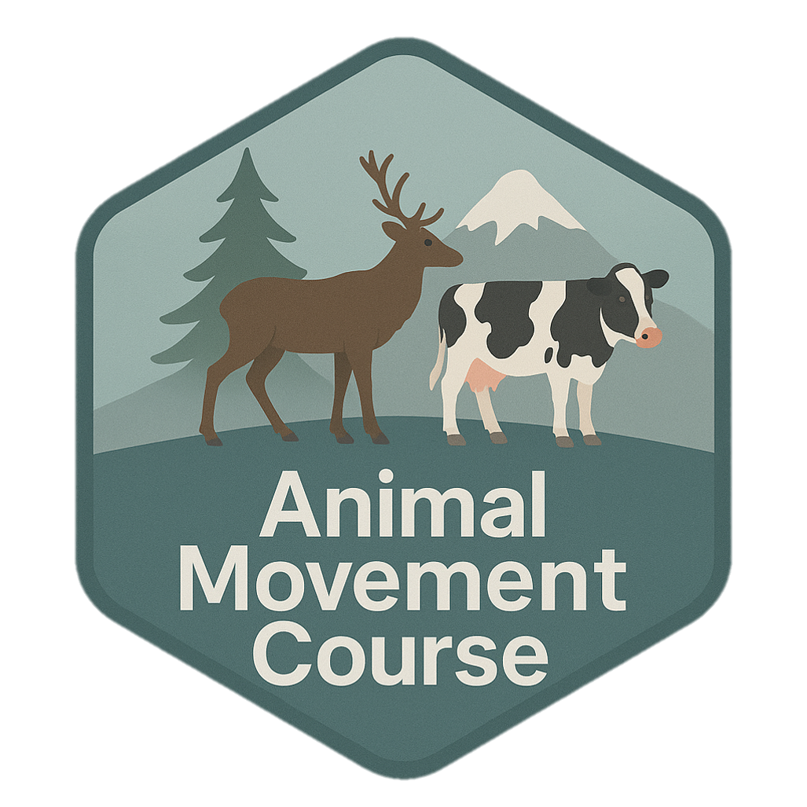
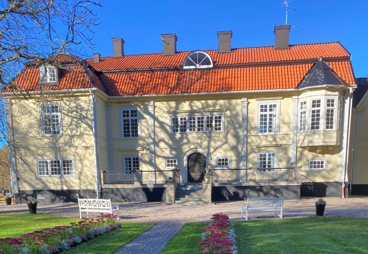
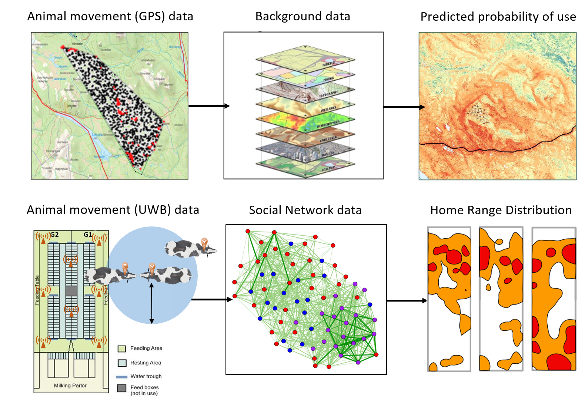

# AnimalMovementCourse

  

Animal movements -- from free ranging to restricted indoor environments.

The aim of this course is to **learn methodological approaches** to analyse movement data on animals in natural, semi-natural, or indoor environments. The focus is on using existing R packages for movement analysis, evaluating how animals are affected by their environments, and what drives their behavioural decisions.

📅 **Course date**: 8--12 September 2025

📍 **Place**: Ekenäs herrgård in Sörmland, Sweden

🔗 **Official course page**: [Animal Movement Course at SLU](https://www.slu.se/en/study/programmes-courses/doctoral-education/research-schools/gs-vmas/courses/)

------------------------------------------------------------------------

## 👩‍🏫 Course leaders

-   Anna Skarin, SLU (AS)
-   Lars Rönnegård, SLU (LR)

## 👨‍🏫 Teachers

-   Johannes Signer, Univ of Goettingen (JS)
-   Bernardo Brandão Niebuhr, NINA (BS)
-   Heidi Rautiainen, SLU (HR)
-   Keni Ren, SLU (KR)
-   Hector Marina, SLU (HM)

------------------------------------------------------------------------

## 📖 Program

### Day 1

-   Introduction to animal movement analysis and technologies (AS, HM, KR)
-   Introduction to data formats (AS, KR)

### Day 2

-   Estimating space use of animals using home ranges (AS, BS, JS)
-   What is (habitat) selection? (AS, BS, JS)

### Day 3

-   Habitat selection and Step-selection (BS, JS)
-   Simulation and animal behaviour prediction (HR, JS)

### Day 4

-   Home ranges and time budgets applied to indoor data (HM, KR)
-   Social network analysis (HM, LR)

### Day 5

-   Lecture about activity sensors (AS, LR)

------------------------------------------------------------------------

## 🤝 Contributing

Pull requests are welcome! Please make sure to update tests as appropriate.

------------------------------------------------------------------------

## 📜 License

This course material is licensed under [Sveriges lantbruksuniversitet](https://www.slu.se/)

------------------------------------------------------------------------
